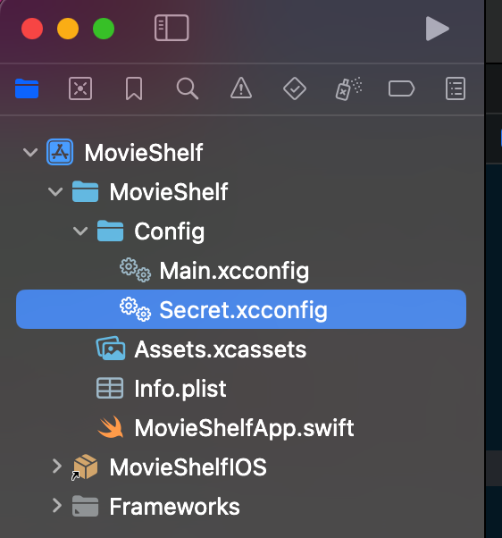

# MovieCatalogueIOS
Ratings and Reviews the Best Movies &amp; TV Shows

## How to run
Create a file named `Secret.xcconfig` that contains apikey declaration like in the example below: 
```
API_KEY_TMDB = yourApiKey
```
Place this file into `MovieShelf/Config` directory:

