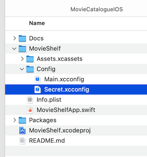
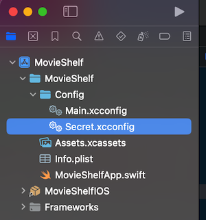

# MovieCatalogueIOS
Ratings and Reviews the Best Movies &amp; TV Shows. This project uses api from themoviedb.org. You can get the apikey [here](https://developer.themoviedb.org).

## How to run
Create a file named `Secret.xcconfig` for the apikey declaration like in the example below: 
```
API_KEY_TMDB = yourApiKey
```
Place this file into `MovieShelf/Config` directory:



